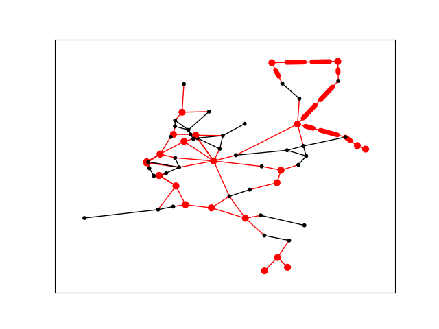

# A variation on Hierholzer's algorithm to generate train services

## Description

Python program in which a railway network (including stations and connections between them) is modelled as a weighted graph using NetworkX. A variation on [Hierholzer's algorithm](https://algorithms.discrete.ma.tum.de/graph-algorithms/hierholzer/index_en.html) is used for generating train services, i.e., sets of train tracks, which in turn consist of sets of edges from the graph.

The algorithm deviates from Hierholzer's in, among other things, choosing random starting nodes with only one edge and some optimization so as to maximize the following score function:

&nbsp;&nbsp;&nbsp;&nbsp;&nbsp;&nbsp;\(score = p\) \* \( 10000 - (t \) \* \(20 + min/100000)\)

where:

- \( p \) is the percentage of connections traversed by the service that are marked as critical, with a connection being critical just in case it's linked to at least one critical station, i.e., a station that's deemed particularly important;
- \( t \) is the number of tracks in the service;
- \( \text{min} \) is the total time of the service.

## Features

#### Current features

- Models a railnetwork using NetworkX and a custom graph class.
- Three datasets with which railnetworks can be modelled are provided: North Holland, the Netherlands, and Middle-earth.
- Implements a variation of Hierholzer’s algorithm with optimization for generating train services.
- Generates the services using a custom services class and its tracks using a custom track class.
- Displays the scores of all generated services using Matplotlib in a bar chart.
- Visualizes the tracks of the service with the highest score using NetworkX.

#### Planned features

- Additional datasets to model a greater number of railnetworks.
- Additional optimizations and enhancements to the algorithm.
- Improved visualization and analysis.

## Installation

- Install Python. This program has been developed using version 3.12.3. Other versions may not be compatible.
- Clone the project from the current Git repository.
- Navigate to the project directory.
- Optional: set up a virtual environment.
- Install the dependencies (NetworkX version 3.3, Matplotlib version 3.9.1) from requirements.txt by running:
  pip install -r requirements.txt

## Usage

To execute the program, navigate to the project directory and run main.py.

You'll be prompted to:

- Select one of three rail networks: North Holland, the Netherlands, or Middle-earth;
- Set the maximum number of tracks per service;
- Define the maximum time per track;
- Speficy the number of services to be generated.

The program then executes the algorithm, which produces the desired number of services. The scores of all services are displayed in a bar chart (results/bar_chart.png) and listed in a csv file (results/scores.csv). The service with the highest score is singled out, with each track visualised and plotted (results/plots/track\_...png). The bar chart, scores, and plotted tracks that are currently in the results folder will have been overwritten.

## Acknowledgments

This program is based on collaborative work with Rick van der Bork and Thom Oosterhuis at the University of Amsterdam in 2017. In the original project, my main contribution was coming up with the use of Hierholzer's algorithm: I was responsible for the implementation, changes, and optimization (for this new version, I’ve revised virtually all parts of the code). The GitHub repository containing our original code can be found here: *https://github.com/RickvBork/railns.NetX.git*
